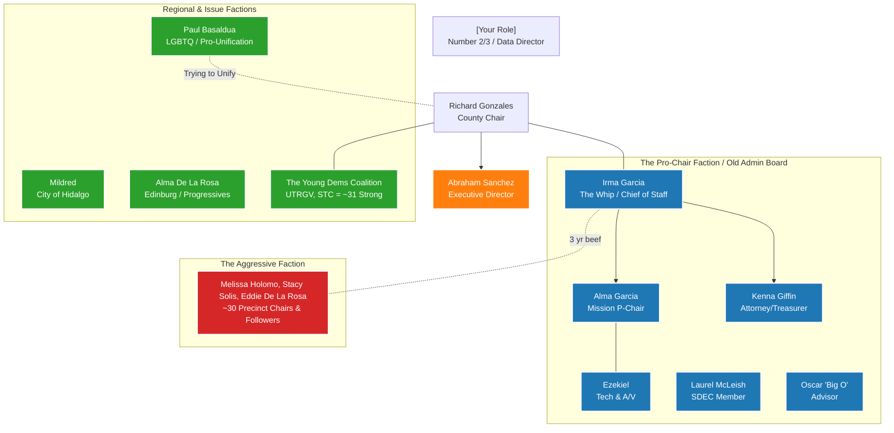

# Hidalgo County Democratic Party - Strategy & Knowledge Map

This document serves as the central hub for leadership strategy, ongoing initiatives, and qualitative notes regarding the operations of the Hidalgo County Democratic Party. As you upload voice memos and share thoughts, we will synthesize them into this knowledge base.

## 🗺️ State of Affairs
*(A high-level overview of the current standing of the party, ongoing challenges, and immediate priorities.)*

- **Public Context (Early 2026):** Local reports indicate turbulence regarding financial transparency, leading to aggressive takeover attempts by an opposing faction. We need to stabilize, organize, and guide the base in a unified direction.
- **Internal Context:** The party has an entrenched "Old Guard" that is great at events but hostile to new volunteers. Conversely, a hostile faction of ~30 precinct chairs is trying to destroy the current administration.
- **Operational Breakdown:** Communication is in shambles. The party meets only once a quarter. We have two conflicting websites, a wrong Google Maps listing, and no official party phone. There is no group SMS tool, and email is nascent. 
- **The Core Objective ("Home Base"):** We must organize our ~1,200 core supporters: Precinct Chairs, Block Captains, loyal volunteers, and subscribers. We cannot rely on the Old Guard, nor can we force people into rigid, top-down models. We need a modern, welcoming communication and engagement loop.

## 🦅 The 2026 Congressional Mission 
Hidalgo County is a critical battlefield for Congressional Districts. The party itself is not financially responsible for these races (the State Party and DCCC will handle it), but we are the ground zero:
- **Defense:** Protect rep Henry Cuellar and rep Vicente Gonzalez.
- **Offense:** Target Monica De La Cruz using Bobby Pulido (South Texas Tejano superstar) to shoot one up the middle.

## ⚙️ Operational Realities & Resources

### 💰 Financials & HQ
- **The War Chest:** Very weak. Currently holding $5,000 to $7,000.
- **The HQ (The War Room):** A massive asset. Alonzo Cantu (ultra-rich benefactor) donates a fully-furnished office worth $2,000/mo. Free rent, free utilities, A/C, fully functioning war room available 24/7.
- **Allied Operations:** Texas Majority PAC (TMP) operates two organizers out of our HQ. However, local volunteers resist their rigid "phone bank / block walk" demands. 

### 📡 Data & Tech Infrastructure
- **Data Muscle:** You have full access to VAN, and as a multi-campaign Data Director, this is your domain.
- **Email:** The new website is hosted on Bluehost with access to `info@hidalgocountydems.org`. 
- **SMS:** No text blaster currently established.
- **Digital Mess:** 2 parallel websites exist. Google Maps has the wrong address. No central phone line.

## ⏱️ Life Architecture & Time Cost
*(Tracking how much personal time and energy this role requires for your broader life architecture management within Obsidian.)*
- **Current Weekly/Daily Commitment:** *[Pending your input]*

## 🧬 Organization & The "Person Map"

## 🎯 Action Items & Immediate Tasks

### 1. Digital Cleanup
- [ ] Fix Google Maps address.
- [ ] Take down or redirect the old competing website.
- [ ] Establish a virtual phone number (e.g., Google Voice) for the party office.

### 2. The 1,200 Group (Infrastructure)
- [ ] Set up the Bluehost outgoing email system for `info@hidalgocountydems.org`.
- [ ] Use VAN list to organize the 1,200 core targets.
- [ ] Send the initial Email Blast out to this list.

### 3. Personnel
- [ ] Fill Party Secretary Vacancy.
- [ ] Build the Volunteer "Red Carpet" intake to bypass the Old Guard (possibly utilizing the TMP organizers without alienating volunteers).

## 📁 Resource Directories
- `/strategy/memos/` - Transcribed voice memos and raw notes.
- `/strategy/initiatives/` - Detailed plans for specific projects.
- `/strategy/communications/` - Drafts for email blasts, press releases, or social updates.
